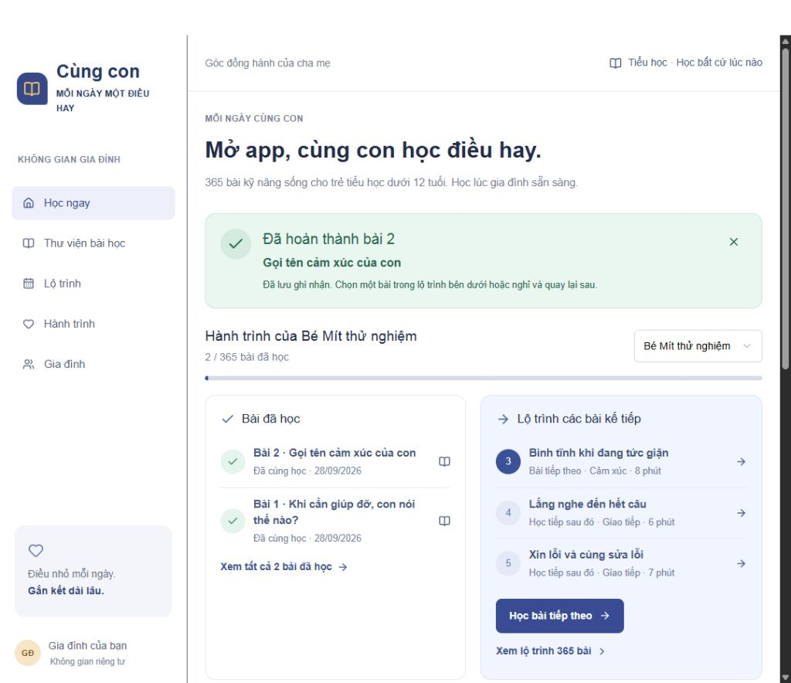

# Mỗi ngày cùng con

Ứng dụng web giúp phụ huynh hướng dẫn **kỹ năng mềm và kỹ năng sống cho học sinh tiểu học dưới 12 tuổi**. Cha mẹ đọc nội dung, kể chuyện, trò chuyện và thực hành cùng con, sau đó ghi nhận kết quả.

**365 bài học · 6 chủ đề · Học bất cứ lúc nào · Dùng trên máy tính và điện thoại**

[Mở app đang được triển khai](https://moi-ngay-cung-con.yenthainam2025.chatgpt.site/) — phiên bản hiện tại là không gian riêng, cần tài khoản có quyền truy cập.



*Ảnh minh họa với hồ sơ thử nghiệm, không phải dữ liệu của trẻ thật.*

## App hoạt động như thế nào?

1. Phụ huynh tạo hồ sơ cho con bằng biệt danh.
2. Mở **Học ngay** để chọn bài tiếp theo, hoặc tìm bài trong **Thư viện bài học**.
3. Hướng dẫn con qua 6 bước: **Chuẩn bị → Kể chuyện → Cùng trò chuyện → Giải thích → Thực hành → Ghi nhận**.
4. Chọn con đã tham gia, ghi kết quả và bấm **Hoàn thành và lưu bài**.
5. Trang chủ hiển thị bài đã học và các bài chưa học tiếp theo. Có thể nghỉ, học tiếp hoặc ôn lại bất cứ lúc nào.

App không đặt giờ học cố định, không gửi nhắc học lúc 22h và không khóa bài theo ngày. Bộ bài dùng chung cho trẻ tiểu học dưới 12 tuổi, không phân loại theo tuổi hay lớp. Phụ huynh điều chỉnh cách giải thích theo mức hiểu của con.

## Các chức năng đã có

- 365 bài với mục tiêu, tình huống, câu hỏi, lời giải thích và hoạt động thực hành.
- Thư viện có tìm kiếm có dấu/không dấu, lọc chủ đề và phân trang.
- Lộ trình 12 chặng để theo dõi 365 bài; mọi bài đều có thể mở.
- Trang chủ có lịch sử học gần đây và 3 bài chưa học kế tiếp.
- Nhật ký ghi nhận **Đã cùng học**, **Đã thực hành**, **Cần luyện thêm**, kèm ghi chú.
- Quản lý tối đa 12 hồ sơ con; xem tiến độ từng con hoặc tổng hợp gia đình.
- Dữ liệu học tập lưu theo tài khoản; dùng cùng tài khoản trên máy tính và điện thoại để tiếp tục học.
- Giao diện tiếng Việt, thiết kế thích ứng màn hình máy tính và điện thoại.

## Bộ 365 bài học

| Chủ đề | Số bài |
| --- | ---: |
| Giao tiếp | 55 |
| Cảm xúc | 63 |
| Tự lập | 65 |
| Tình bạn | 56 |
| An toàn | 73 |
| Trách nhiệm | 53 |
| **Tổng cộng** | **365** |

Xem [cấu trúc bộ bài học](docs/curriculum.md). Các bài an toàn sử dụng kể chuyện và tình huống giả định; phụ huynh không tạo nguy hiểm thật để thực hành.

## Chạy trên máy của bạn

Cần Node.js **22.13.0 trở lên**, npm và kết nối mạng để tải các thư viện lần đầu. Mở terminal tại thư mục chứa mã nguồn, rồi chạy:

```sh
npm run install:ci
npm run build
node --import ./scripts/sites-env.mjs ./node_modules/wrangler/bin/wrangler.js d1 execute DB --local --config dist/server/wrangler.json --persist-to .wrangler/state --file drizzle/0000_next_malcolm_colcord.sql
npm run dev
```

Lệnh tạo bảng chỉ chạy **một lần cho cơ sở dữ liệu local mới**. Nếu bảng đã có, bỏ qua lệnh này.

Mở địa chỉ hiện trong terminal, mặc định là **http://localhost:5173**. Bản phát triển có đăng nhập thử nghiệm trên máy local; dữ liệu thử được lưu riêng trên máy, không lấy dữ liệu từ app đang triển khai.

Hướng dẫn đầy đủ: [Cài đặt và triển khai](docs/CAI_DAT_VA_TRIEN_KHAI.md).

## Công nghệ và cấu trúc

React 19, TypeScript, giao diện theo Next.js App Router, vinext/Vite, Tailwind CSS, Cloudflare Workers và D1. Các phiên bản cụ thể nằm trong `package.json` và `package-lock.json`.

| Đường dẫn | Vai trò |
| --- | --- |
| `app/family-app.tsx` | Giao diện và luồng học của gia đình |
| `app/api/family/route.ts` | Đọc và lưu dữ liệu gia đình |
| `app/chatgpt-auth.ts` | Nhận danh tính đăng nhập từ nền tảng Sites |
| `lib/lessons.ts`, `lib/year-curriculum.ts` | Nội dung 365 bài |
| `lib/learning-path.ts` | Tính lịch sử và bài học tiếp theo |
| `lib/family.ts` | Kiểm tra dữ liệu hồ sơ và ghi nhận |
| `db/`, `drizzle/` | Cấu trúc cơ sở dữ liệu và migration |
| `public/` | Hình ảnh và biểu tượng |
| `docs/` | Tài liệu sử dụng, cài đặt và GitHub |

## Tài liệu

- [Hướng dẫn sử dụng cho phụ huynh](docs/HUONG_DAN_SU_DUNG.md)
- [Cài đặt, kiểm tra và triển khai](docs/CAI_DAT_VA_TRIEN_KHAI.md)
- [Đưa tài liệu và mã nguồn lên GitHub](docs/DANG_LEN_GITHUB.md)
- [Dữ liệu, API và quy tắc lộ trình](docs/DU_LIEU_VA_KIEN_TRUC.md)
- [Bộ 365 bài học](docs/curriculum.md)

## GitHub và hosting

GitHub lưu mã nguồn và tài liệu. Việc upload lên GitHub **không tự triển khai app**. Phiên bản này cần máy chủ, cơ sở dữ liệu D1 và đăng nhập, nên không chạy nguyên bản bằng GitHub Pages.

Khi chuyển sang hosting khác, cần cấu hình cơ sở dữ liệu và thay hoặc tích hợp lớp đăng nhập. Xem các yêu cầu trong [hướng dẫn triển khai](docs/CAI_DAT_VA_TRIEN_KHAI.md#triển-khai-lên-web).

## Giấy phép

Dự án chưa chỉ định giấy phép chung cho mã nguồn và nội dung bài học. Chủ dự án cần lựa chọn giấy phép nếu muốn cho phép bên khác sử dụng hoặc phân phối lại. Các thành phần bên thứ ba có giấy phép riêng, gồm [Sites Vite plugin](build/sites-vite-plugin.LICENSE) và [Shadcn Tailwind](vendor/shadcn-tailwind-4.13.0.LICENSE.md).
